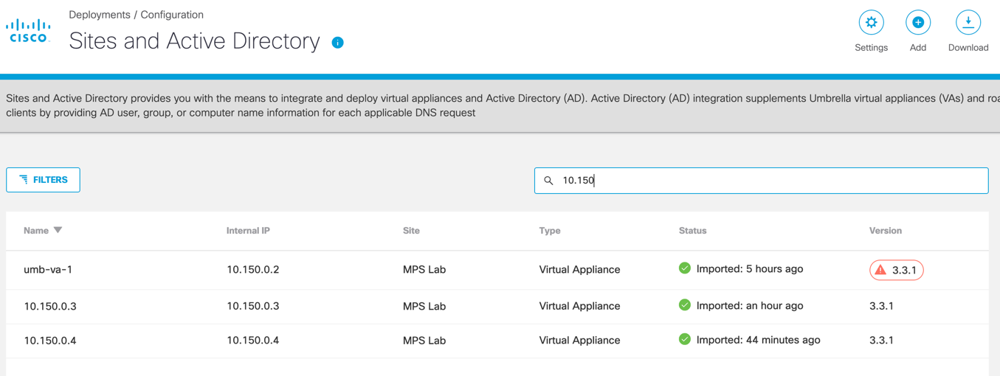

# Terraform-Umbrella-VA-GCP
 Terraform to deploy Cisco Umbrella Virtual Appliances into GCP.

## Prerequisites
Create the Umbrella Virtual Appliance Template in GCP before applying these resources.
Make sure your environment variables are defined in the variables.tf file.

## Steps
1. Create the Umbrella Virtual Appliance Template in GCP.
   https://docs.umbrella.com/deployment-umbrella/docs/deploy-vas-in-google-cloud-platform
2. Update your variables in variables.tf file.
```terraform
variable "gcp-project-name" {
  description = "Name of the GCP Project"
  default = "my-project"
}
variable "gcp-region" {
  description = "GCP Region"
  default = "us-east4"
}
variable "gcp-zone" {
  description = "GCP Zone"
  default = "us-east4-a"
}
```
3. Define a GCP network to attach the Umbrella VA instances to. 
```terraform
# Create Network
resource "google_compute_network" "vpc_network" {
  name                    = "gcp-network"
  auto_create_subnetworks = "true"
}
```
4. Fetch the Umbrella VA Template you created in step 1.
```terraform
data "google_compute_instance_template" "umb_va_temp" {
  project = var.gcp-project-name
  name    = "umbrella-va-instance-template"
}
```
5. Create instance A from Umbrella VA template and attach to network.
```terraform
resource "google_compute_instance_from_template" "umb_va_a" {
  name = "umb-va-a"
  zone = var.gcp-zone

  source_instance_template = data.google_compute_instance_template.umb_va_temp.id

  network_interface {
    # A default network is created for all GCP projects
    network = google_compute_network.vpc_network.self_link
    access_config {
    }
  }
}
```
6. Create instance B from Umbrella VA Template and attach to network.
```terraform
resource "google_compute_instance_from_template" "umb_va_b" {
  name = "umb-va-b"
  zone = var.gcp-zone

  source_instance_template = data.google_compute_instance_template.umb_va_temp.id

  network_interface {
    # A default network is created for all GCP projects
    network = google_compute_network.vpc_network.self_link
    access_config {
    }
  }
}
```
7. Verify that Umbrella Virtual Appliances are discovered in Umbrella portal under `Deployments > Configurations > Sites
and Active Directory`. Discovery may take 10-15 minutes.



